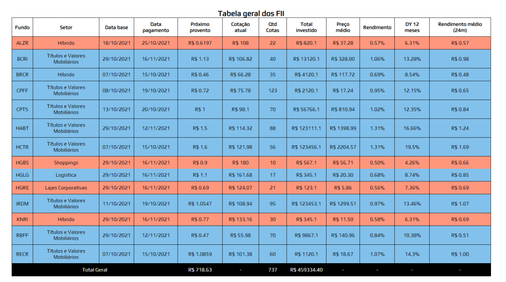

# Tabela-Fundos-Investimentos-Imobiliarios

-
Projeto da matéria de Programação Web no curso de Ciência da Computação no 2° Semestre. A tabela consiste em uma simulção da carteira de fundos de um investidor fictício da Bolsa de Valores.

API desenvolvida e implementada pelo meu professor da matéria de PW. Os arquivos JSON e HTML e CSS também foram disponibilizado pelo professor. Apenas consulta da API em JavaScript foi implementada por mim e pelo meu grupo, sob supervisão do professor na apresentação do projeto. 
-
My project for the Web Programming subject in the Computer Science course. The table is basically an simulation of a fictional investor's portfolio in the stock market and his respective investments.

API developed and implemented by my PW professor. The JSON and HTML & CSS files were also made available by my teacher. 

Only the API query in JavaScript was implemented by me and my group, under supervision of my teacher in the presentation of the project.
